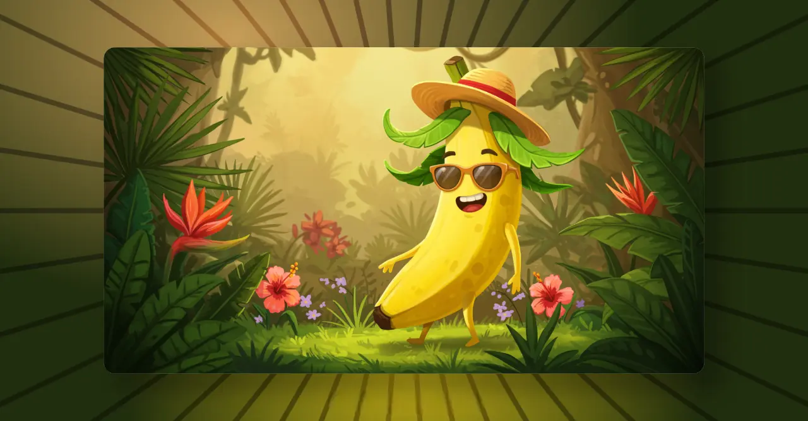

# NanoBanana Demo



AI Image Playground — generate, edit, and upscale images with AI.

## Features

### 🎨 Generate

Create stunning images from text prompts using state-of-the-art AI models.

- Multiple aspect ratios: 1:1, 16:9, 9:16, 4:3, 3:4, and more
- Resolution options: 1K, 2K
- Quality presets: Auto, Low, High, HD
- Batch generation: up to 4 images at once
- Negative prompts for fine control
- Seed support for reproducibility
- Prompt enhancement with AI

### ✏️ Edit

Modify existing images using natural language instructions.

- Upload images or provide URLs
- AI-powered editing with text prompts
- Before/after comparison view
- Uses `nano-banana` model

### 🔍 Upscale

Enhance image resolution up to 4x.

- Upscale factors: 2x, 3x, 4x
- Supports URL or file upload
- Uses Google's `imagen-4.0-upscale-preview`

## Supported Models

| Model                           | Provider           | Type          | Notes                  |
| ------------------------------- | ------------------ | ------------- | ---------------------- |
| `nano-banana`                   | nano-banana-editor | Generate/Edit | Default, max 1 image   |
| `imagen-4.0-ultra-generate-001` | Google             | Generate      | Highest quality, max 4 |
| `imagen-4.0-generate-001`       | Google             | Generate      | High quality, max 4    |
| `imagen-4.0-fast-generate-001`  | Google             | Generate      | Fast, max 4            |
| `imagen-3.0-generate-002`       | Google             | Generate      | Stable, max 4          |
| `imagen-3.0-generate-001`       | Google             | Generate      | Classic, max 4         |
| `imagen-3.0-fast-generate-001`  | Google             | Generate      | Quick, max 4           |
| `imagen-4.0-upscale-preview`    | Google             | Upscale       | 2x/3x/4x               |

## API

**Base URL:** `https://nanobanana.aikit.club`

| Endpoint                 | Method | Description                 |
| ------------------------ | ------ | --------------------------- |
| `/v1/images/generations` | POST   | Generate images from prompt |
| `/v1/images/edits`       | POST   | Edit existing images        |
| `/v1/images/upscale`     | POST   | Upscale image resolution    |
| `/v1/models`             | GET    | List available models       |

📖 **Full API Docs:** [nano-banana-api.readme.io](https://nano-banana-api.readme.io/)

## Stack

- **React 18** — UI library
- **TypeScript** — Type safety
- **Vite** — Build tool
- **Tailwind CSS** — Styling
- **shadcn/ui** — Component library
- **TanStack Query** — Data fetching
- **React Router** — Routing

## Setup

```bash
git clone https://github.com/tanu360/nanobananademo.git
cd nanobananademo
npm install
npm run dev
```

## Scripts

| Command           | Description      |
| ----------------- | ---------------- |
| `npm run dev`     | Start dev server |
| `npm run build`   | Production build |
| `npm run lint`    | Run ESLint       |
| `npm run preview` | Preview build    |
