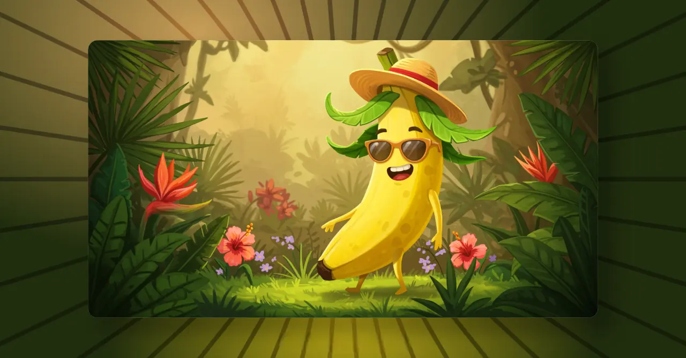

<div align="center">
  

  <h1>🍌 NanoBanana Demo</h1>

  <p>
    <strong>A React playground for AI image generation, editing, and upscaling with Nano Banana and Google Imagen models</strong>
  </p>

  <p>
    <a href="#-overview">Overview</a> •
    <a href="#-openapi-docs">OpenAPI Docs</a> •
    <a href="#-key-features">Features</a> •
    <a href="#-supported-models">Models</a> •
    <a href="#-supported-endpoints">Endpoints</a> •
    <a href="#-quick-start">Quick Start</a> •
    <a href="#-usage-examples">Usage Examples</a>
  </p>

  <br/>
</div>



## 🌟 Overview

NanoBanana Demo is an AI image playground built around the Nano Banana API. It gives you a clean web interface for generating, editing, and upscaling images while exposing OpenAI-compatible image endpoints for direct API usage.

It is designed for fast experimentation with `nano-banana` and Google Imagen models, with support for prompt-driven workflows, multiple aspect ratios, quality presets, and downloadable results.

## 📘 OpenAPI Docs

### API documentation: https://nano-banana-api.readme.io/

- **Spec file**: `nano.json` (OpenAPI 3.0.0)
- **What it is**: OpenAI-compatible API documentation covering image generation, edits, upscaling, available models, request formats, and example responses
- **How to use**:
  - Import `nano.json` into Swagger UI, Redocly, Postman, Bruno, or Insomnia
  - Generate typed clients with tools like `openapi-generator` or `orval`
- **Server**: Defaults to `https://nanobanana.aikit.club`

## 🚀 Key Features

| Feature | Description |
| ------- | ----------- |
| 🍌 **AI Image Playground** | Generate, edit, and upscale images from one interface |
| 🎨 **Text-to-Image** | Create images from prompts with Nano Banana and Imagen 4 models |
| ✏️ **Prompt-Based Editing** | Modify existing images with natural language instructions |
| 🔍 **AI Upscaling** | Improve image resolution with `2x` and `4x` upscale options |
| 📐 **Flexible Output Controls** | Choose aspect ratios like `1:1`, `16:9`, `9:16`, `4:3`, and `3:4` |
| ⚡ **Quality and Batch Options** | Use `Auto`, `Low`, `High`, or `HD` presets and generate up to 4 images on supported models |
| 🌐 **OpenAI-Compatible API** | Work with familiar `/v1/images/*` and `/v1/models` endpoints |
| 🖼️ **Preview and Download** | Review results in the UI and save generated assets locally |

## 🛠️ Supported Models

| Model | Provider | Type | Notes |
| ----- | -------- | ---- | ----- |
| `nano-banana` | nano-banana-editor | Generate / Edit | Default model, max 1 image |
| `imagen-4.0-ultra-generate-001` | Google | Generate | Highest quality, max 4 images |
| `imagen-4.0-generate-001` | Google | Generate | High quality, max 4 images |
| `imagen-4.0-fast-generate-001` | Google | Generate | Fast generation, max 4 images |
| `imagen-4.0-upscale-preview` | Google | Upscale | Supports `x2` and `x4` |

## 🧩 Supported Endpoints

**Base URL:** `https://nanobanana.aikit.club`

| Endpoint | Method | Description |
| -------- | ------ | ----------- |
| `/v1/models` | `GET` | List available models |
| `/v1/images/generations` | `GET`, `POST` | Generate images from a text prompt |
| `/v1/images/edits` | `GET`, `POST` | Edit an existing image |
| `/v1/images/upscale` | `GET`, `POST` | Upscale image resolution |

## 🚀 Quick Start

### Run the demo locally

```bash
git clone https://github.com/tanu360/nanobananademo.git
cd nanobananademo
npm install
npm run dev
```

### Build for production

```bash
npm run build
npm run preview
```

## 💡 Usage Examples

### Generate images

```javascript
const response = await fetch("https://nanobanana.aikit.club/v1/images/generations", {
  method: "POST",
  headers: {
    "Content-Type": "application/json",
  },
  body: JSON.stringify({
    prompt: "A serene mountain landscape at sunset",
    model: "imagen-4.0-generate-001",
    n: 1,
    size: "1:1",
    quality: "auto",
    response_format: "url",
  }),
});
```

### Edit an image

```javascript
const response = await fetch("https://nanobanana.aikit.club/v1/images/edits", {
  method: "POST",
  headers: {
    "Content-Type": "application/json",
  },
  body: JSON.stringify({
    prompt: "Add a rainbow in the sky",
    image: "https://example.com/image.png",
    response_format: "url",
  }),
});
```

### Edit an uploaded image

```javascript
const formData = new FormData();
formData.append("prompt", "Turn this into a cinematic poster");
formData.append("image", file);

const response = await fetch("https://nanobanana.aikit.club/v1/images/edits", {
  method: "POST",
  body: formData,
});
```

### Upscale an image

```javascript
const response = await fetch("https://nanobanana.aikit.club/v1/images/upscale", {
  method: "POST",
  headers: {
    "Content-Type": "application/json",
  },
  body: JSON.stringify({
    image: "https://example.com/image.png",
    upscale_factor: "x4",
    response_format: "url",
  }),
});
```

### List models

```javascript
const response = await fetch("https://nanobanana.aikit.club/v1/models");
const models = await response.json();
```

## ⚙️ Stack

- **React 18** for the UI
- **TypeScript** for type safety
- **Vite** for development and builds
- **Tailwind CSS** for styling
- **shadcn/ui** for UI primitives
- **TanStack Query** for data fetching
- **React Router** for routing

## 📜 Scripts

| Command | Description |
| ------- | ----------- |
| `npm run dev` | Start the local dev server |
| `npm run build` | Create a production build |
| `npm run build:dev` | Build in development mode |
| `npm run lint` | Run ESLint |
| `npm run preview` | Preview the production build |
